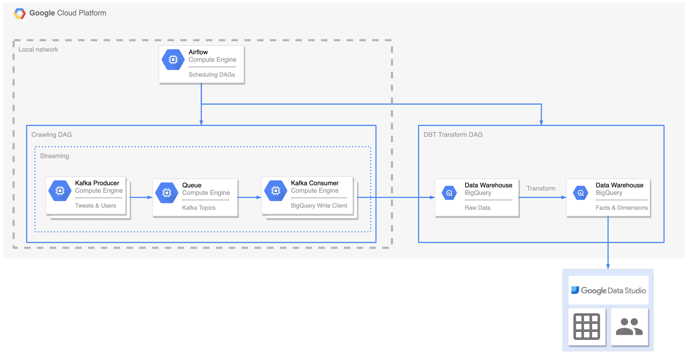

<!-- Improved compatibility of back to top link: See: https://github.com/othneildrew/Best-README-Template/pull/73 -->
<a name="readme-top"></a>
<!--
*** Thanks for checking out the Best-README-Template. If you have a suggestion
*** that would make this better, please fork the repo and create a pull request
*** or simply open an issue with the tag "enhancement".
*** Don't forget to give the project a star!
*** Thanks again! Now go create something AMAZING! :D
-->


<!-- PROJECT SHIELDS -->
<!--
*** I'm using markdown "reference style" links for readability.
*** Reference links are enclosed in brackets [ ] instead of parentheses ( ).
*** See the bottom of this document for the declaration of the reference variables
*** for contributors-url, forks-url, etc. This is an optional, concise syntax you may use.
*** https://www.markdownguide.org/basic-syntax/#reference-style-links
-->
[![Contributors][contributors-shield]][contributors-url]
[![Forks][forks-shield]][forks-url]
[![Stargazers][stars-shield]][stars-url]
[![Issues][issues-shield]][issues-url]
[![MIT License][license-shield]][license-url]
[![LinkedIn][linkedin-shield]][linkedin-url]


<!-- PROJECT LOGO -->
<br />
<div align="center">
  <a href="https://github.com/koksang/social-media-analysis">
    
  </a>

<h3 align="center">Social Media Analysis</h3>

  <p align="center">
    End-to-end deployment for analysing social media contents
    <br />
    <a href="https://github.com/koksang/social-media-analysis"><strong>Explore the docs »</strong></a>
    <br />
    <br />
    <a href="https://github.com/koksang/social-media-analysis">View Demo</a>
    ·
    <a href="https://github.com/koksang/social-media-analysis/issues">Report Bug</a>
    ·
    <a href="https://github.com/koksang/social-media-analysis/issues">Request Feature</a>
  </p>
</div>


<!-- TABLE OF CONTENTS -->
<details>
  <summary>Table of Contents</summary>
  <ol>
    <li>
      <a href="#about-the-project">About The Project</a>
      <ul>
        <li><a href="#built-with">Built With</a></li>
      </ul>
    </li>
    <li>
      <a href="#getting-started">Getting Started</a>
      <ul>
        <li><a href="#prerequisites">Prerequisites</a></li>
        <li><a href="#installation">Installation</a></li>
      </ul>
    </li>
    <li><a href="#usage">Usage</a></li>
    <li><a href="#roadmap">Roadmap</a></li>
    <li><a href="#contributing">Contributing</a></li>
    <li><a href="#license">License</a></li>
    <li><a href="#acknowledgments">Acknowledgments</a></li>
  </ol>
</details>


<!-- ABOUT THE PROJECT -->
## About The Project



This is a simple and scalable end-to-end solution that analyses tweets & users of selected topics. Its made to be crypto / blockchain related here such as crypto KOLs, applications and tokens.
It deploys
- [x] Scalable crawler that crawls
    - [x] Tweets of topics mentioning influencers such as Elon Musk, Vitalik, applications such as DeFi, Metaverse, tokens suchs as $BTC, $ETH, $ADA
    - [x] Users mentioning the tweets above, are snapshotted daily
- [x] Stream ingestion of crawled data into data warehouse
    - [x] Tweets data
    - [x] Users data
- [x] Clean and transform data into dimensions that models
    - [x] Token interests - grouped by crypto KOLs
    - [x] Token interests - grouped by crypto applications
- [x] [**BI Dashboard**][datastudio-url] - shows insights of token interests in different segment of social media users


<p align="right">(<a href="#readme-top">back to top</a>)</p>


### Built With

* [Apache Airflow][apacheairflow-url]
* [Apache Kafka][apachekafka-url]
* [Ray][ray-url]
* [BigQuery][bigquery-url]
* [DBT][dbt-url]

<p align="right">(<a href="#readme-top">back to top</a>)</p>


<!-- GETTING STARTED -->
## Getting Started

Currently, the setup can only be done in a single machine. Everything is in containers, runs on docker-compose, so you will need docker installed.

### Prerequisites

You will need docker engine & docker-compose cli such as [docker-compose][dockercompose-url]. I am on *MacOS* and use a combination of [Colima][colima-url] & [brew docker-compose][dockercomposemacos-url]

* docker-compose cli

    ```console
    $ brew install colima docker-compose
    ```

You will need a Google Cloud Platform account in order to setup BigQuery and the credentials in order for it to work
* [Google Cloud Platform][gcp-url]
* [Application Authentication][appauth-url]

You will need python libraries and dependency manager such as *pip*. I use *poetry*
* [Poetry][poetry-url]

    ```console
    $ curl -sSL https://raw.githubusercontent.com/python-poetry/poetry/master/get-poetry.py | python -
    ```

### Installation
1. Clone the repo

    ```console
    $ git clone https://github.com/koksang/social-media-analysis.git
    ```

2. To install dependencies locally especially **DBT**, you can do
    * Poetry

        ```console
        $ poetry install
        ```
    Or if you use *pip*
    * Pip
        ```console
        $ poetry export -f requirements.txt --without-hashes
        $ pip install -r requirements.txt

        ---> 100%
        ```

3. Start `docker-compose.yaml` by doing as below. It will start in detached mode

    ```console
    $ docker-compose -f infra/docker-compose.yaml up -d
    ```

4. Set environment variables
    * Google Cloud specific

        ```console
        $ export GOOGLE_APPLICATION_CREDENTIALS=${YOUR PATH TO GOOGLE_APPLICATION_CREDENTIALS}
        $ export GOOGLE_PROJECT_ID=${YOUR GOOGLE_PROJECT_ID}
        ```

<p align="right">(<a href="#readme-top">back to top</a>)</p>


<!-- USAGE EXAMPLES -->
## Usage

Todo


<p align="right">(<a href="#readme-top">back to top</a>)</p>


<!-- ROADMAP -->
## Roadmap

- [x] Deploy [BI Dashboard][datastudio-url] for insights visualization
- [ ] Finalize docker-compose deployment
- [ ] Convert docker-compose deployment into K8s
- [ ] Use other BI dashboards (such as: [apache/superset](https://github.com/apache/superset))
- [ ] Crawl more
    - [ ] Nested tweet replies
    - [ ] Top trends
    - [ ] User profiles snapshot

See the [open issues](https://github.com/koksang/social-media-analysis/issues) for a full list of proposed features (and known issues).

<p align="right">(<a href="#readme-top">back to top</a>)</p>


<!-- CONTRIBUTING -->
## Contributing

Contributions are what make the open source community such an amazing place to learn, inspire, and create. Any contributions you make are **greatly appreciated**.

If you have a suggestion that would make this better, please fork the repo and create a pull request. You can also simply open an issue with the tag "enhancement".
Don't forget to give the project a star! Thanks again!

1. Fork the Project
2. Create your Feature Branch (`git checkout -b feature/AmazingFeature`)
3. Commit your Changes (`git commit -m 'Add some AmazingFeature'`)
4. Push to the Branch (`git push origin feature/AmazingFeature`)
5. Open a Pull Request

<p align="right">(<a href="#readme-top">back to top</a>)</p>


<!-- LICENSE -->
## License

Distributed under the MIT License. See `LICENSE.txt` for more information.

<p align="right">(<a href="#readme-top">back to top</a>)</p>


<!-- ACKNOWLEDGMENTS -->
## Acknowledgments

* [Best-README-Template](https://github.com/othneildrew/Best-README-Template)

<p align="right">(<a href="#readme-top">back to top</a>)</p>


<!-- MARKDOWN LINKS & IMAGES -->
<!-- https://www.markdownguide.org/basic-syntax/#reference-style-links -->
[contributors-shield]: https://img.shields.io/github/contributors/koksang/social-media-analysis.svg?style=for-the-badge
[contributors-url]: https://github.com/koksang/social-media-analysis/graphs/contributors
[forks-shield]: https://img.shields.io/github/forks/koksang/social-media-analysis.svg?style=for-the-badge
[forks-url]: https://github.com/koksang/social-media-analysis/network/members
[stars-shield]: https://img.shields.io/github/stars/koksang/social-media-analysis.svg?style=for-the-badge
[stars-url]: https://github.com/koksang/social-media-analysis/stargazers
[issues-shield]: https://img.shields.io/github/issues/koksang/social-media-analysis.svg?style=for-the-badge
[issues-url]: https://github.com/koksang/social-media-analysis/issues
[license-shield]: https://img.shields.io/github/license/koksang/social-media-analysis.svg?style=for-the-badge
[license-url]: https://github.com/koksang/social-media-analysis/blob/main/LICENSE.txt
[linkedin-shield]: https://img.shields.io/badge/-LinkedIn-black.svg?style=for-the-badge&logo=linkedin&colorB=555
[linkedin-url]: https://linkedin.com/in/koksang

<!-- git repo -->
[dcyaml-url]: https://github.com/koksang/social-media-analysis/tree/main/infra/dc.yaml

<!-- setup -->
[dockercompose-url]: https://docs.docker.com/compose/install
[colima-url]: https://github.com/abiosoft/colima
[dockercomposemacos-url]: https://formulae.brew.sh/formula/docker-compose
[gcp-url]: https://cloud.google.com
[appauth-url]: https://cloud.google.com/docs/authentication/getting-started#setting_the_environment_variable
[poetry-url]: https://python-poetry.org/docs/#installation

<!-- url -->
[apacheairflow-url]: https://airflow.apache.org
[apachekafka-url]: https://kafka.apache.org
[ray-url]: https://www.ray.io
[bigquery-url]: https://cloud.google.com/bigquery
[dbt-url]: https://docs.getdbt.com

<!-- results -->
[datastudio-url]: https://datastudio.google.com/u/0/reporting/670ca43b-52b7-4a16-a9de-0188bdd7848e/page/f5J0C
